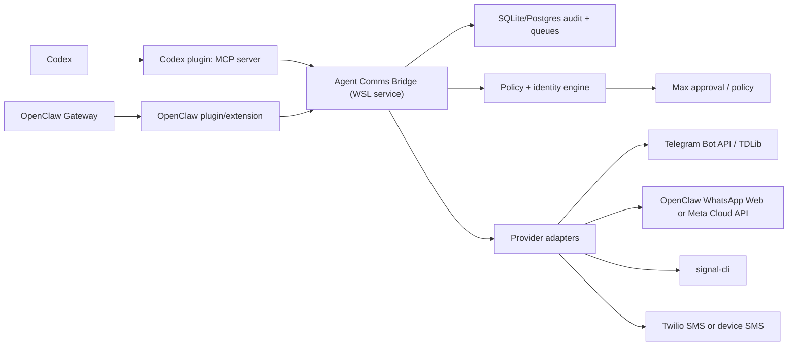

# Agent Comms Bridge Deep Dive

Date: 2026-07-09

## Executive recommendation

Build one local WSL-hosted **Agent Comms Bridge** with two integration faces:

1. A Codex plugin that bundles an MCP server exposing safe messaging tools.
2. An OpenClaw plugin/extension that calls the same bridge and/or registers a native channel.

Do not build four separate Codex plugins. The durable unit should be a shared service with provider adapters, a policy engine, approvals, and an audit log. Codex and OpenClaw should both become clients of that service.

The default posture should be:

- **Bot mode:** allowed for explicit bot identities and operational notifications.
- **Act-as-me mode:** draft-by-default; send only after explicit Max approval, except for narrowly configured self-notifications.
- **Inbound handling:** authorize before agent-routing; unknown senders stay silent or get pairing, depending on channel policy.
- **Outbound writes:** logged, idempotent, and reversible only where the provider supports it.

## What is installed now

Google access in this Codex session:

- Google Drive connector is active. A shared-drive read returned no shared drives, which only means no accessible shared drives were listed.
- Gmail plugin was installed and profile-read succeeded for `olivia@allsystemsgreen.io`.

OpenClaw local facts:

- WSL OpenClaw home: `\\wsl.localhost\Ubuntu\home\max\.openclaw`.
- WSL OpenClaw workspace: `\\wsl.localhost\Ubuntu\home\max\.openclaw\workspace`.
- Installed Windows OpenClaw package: `C:\Users\Max\AppData\Roaming\npm\node_modules\openclaw`.
- OpenClaw docs say the current Google Workspace CLI account is `spooner@allsystemsgreen.io`, which is not the same as the Codex Gmail connector profile above.
- OpenClaw already ships channel docs/extensions for WhatsApp, Telegram, Signal, and generic `openclaw message`.
- OpenClaw does not appear to ship a Twilio SMS chat channel, but it has Android-node SMS, macOS iMessage/SMS, and Twilio voice-call provider code that can be reused for request signing/API patterns.

## Channel reality check

### Telegram

Best fit:

- Bot mode: use Telegram Bot API through OpenClaw's existing Telegram channel.
- Act-as-me mode: use Telegram TDLib/MTProto in a separate adapter, only if truly needed.

OpenClaw status:

- Built-in Telegram channel is production-ready via Bot API and grammY.
- It supports bot DMs, groups, long polling, optional webhooks, allowlists, pairing, group mention gates, reactions, delete/edit actions, inline buttons, and topic routing.

Risk:

- Telegram bot mode is straightforward.
- Telegram user-account automation should be treated as sensitive because it controls a personal client session rather than a bot identity.

### Signal

Best fit:

- Bot mode: dedicated Signal number through `signal-cli`.
- Act-as-me mode: possible by linking/running a personal Signal account, but not recommended.

OpenClaw status:

- OpenClaw's Signal channel talks to `signal-cli` over HTTP JSON-RPC plus SSE.
- Docs strongly recommend a separate bot number.
- If using a personal Signal account, OpenClaw may ignore own messages for loop protection.

Risk:

- Signal has no clean official bot API. This is an external CLI integration.
- `signal-cli` stores account keys locally. Losing the number/account state can complicate recovery.

### WhatsApp

Best fit:

- For a personal/ops bot: OpenClaw WhatsApp Web channel on a separate number is the pragmatic local route.
- For a compliant business/customer workflow: Meta WhatsApp Business Platform / Cloud API.
- For a general-purpose AI assistant distributed through WhatsApp Business Solution: avoid; current WhatsApp terms are hostile to this use case.

OpenClaw status:

- Built-in WhatsApp channel is production-ready via WhatsApp Web/Baileys.
- OpenClaw recommends a separate number, but personal-number fallback is supported.
- The built-in channel is Web-only. OpenClaw docs explicitly say there is no separate Twilio WhatsApp messaging channel in the built-in registry.

Policy constraint:

- WhatsApp Business Solution Terms modified March 6, 2026 prohibit AI/ML providers from using WhatsApp Business Solution where the AI technology is the primary functionality, subject to regional exceptions and Meta discretion.
- If the feature is "Max's private ops bridge" or business-specific support, keep it narrow, documented, and not positioned as a public general AI assistant on WhatsApp.

### SMS

Best fit:

- Bot mode: Twilio Programmable Messaging with a dedicated business number.
- Act-as-me mode: only through a device-backed sender, such as OpenClaw Android node `sms.send`, or macOS Messages/BlueBubbles/iMessage if a Mac is in the loop.

OpenClaw status:

- `openclaw message` does not list `sms` as a first-class channel.
- OpenClaw Android nodes can expose `sms.send` when SMS permission and telephony support exist.
- OpenClaw has iMessage/SMS paths, but this machine is Windows/WSL, not macOS.
- OpenClaw voice-call plugin already contains Twilio credential/config/webhook verification patterns that are useful for an SMS plugin.

Compliance constraint:

- For US SMS from an application over a 10DLC number, Twilio A2P 10DLC registration is required. Treat this as mandatory before production SMS sends.

## Proposed architecture



### Core WSL service

Run a local service under WSL, for example:

`/home/max/.openclaw/workspace/projects/allsystemsgreen/agent-comms-bridge`

Suggested components:

- `src/server.ts`: local HTTP API plus optional MCP stdio wrapper.
- `src/mcp.ts`: Codex-facing MCP tools.
- `src/policy.ts`: approval, persona, channel, allowlist, and compliance checks.
- `src/adapters/openclaw.ts`: calls `openclaw message` or OpenClaw gateway RPC for existing channels.
- `src/adapters/twilio-sms.ts`: Twilio SMS send/status/inbound webhook.
- `src/store.ts`: SQLite first; Postgres later if it needs CTRL/TelemetryBase visibility.
- `src/audit.ts`: append-only outbound/inbound/action records.
- `src/approvals.ts`: pending outbound queue and approval tokens.

### Codex plugin face

Create a local Codex plugin with:

- `.codex-plugin/plugin.json`
- `.mcp.json` pointing to the bridge MCP stdio server
- `skills/agent-comms/SKILL.md` that teaches Codex the send/approval policy
- optional assets/metadata for the plugin card

Codex docs support plugins bundling MCP servers; installed plugin MCP servers can be enabled/disabled and have per-tool policy configured from Codex config.

Recommended Codex MCP tools:

- `comms_profiles`: list available personas and channel capabilities.
- `comms_resolve_recipient`: normalize a person/chat to a channel target.
- `comms_draft`: create a pending outbound message without sending.
- `comms_request_send`: run policy and queue/send depending on approval requirements.
- `comms_approve`: approve a queued outbound message by ID.
- `comms_cancel`: cancel a pending outbound.
- `comms_read_thread`: read normalized recent conversation context.
- `comms_search`: search indexed conversations/audit logs.
- `comms_status`: provider health and auth state.

Tool policy should default to:

- `comms_read_thread`, `comms_search`, `comms_status`: auto or prompt depending on data sensitivity.
- `comms_draft`: auto.
- `comms_request_send`, `comms_approve`: prompt/explicit approval.

### OpenClaw plugin face

Two viable OpenClaw strategies:

1. **Thin wrapper first:** use existing OpenClaw Telegram/WhatsApp/Signal channels and add a `agent-comms` extension that forwards normalized messages to the bridge, registers quick commands, and exposes status/approval commands.
2. **Native channel later:** register a new `agentcomms` channel using OpenClaw's channel plugin API when we need bridge-owned routing to appear as a first-class OpenClaw channel.

Thin wrapper is the better v1 because OpenClaw already owns the hard pieces for Telegram, WhatsApp, and Signal:

- pairing
- group policies
- mention gates
- session routing
- media handling
- reconnect behavior
- Telegram Bot API quirks
- WhatsApp Web/Baileys session management
- Signal `signal-cli` daemon handling

OpenClaw plugin hooks/commands to add:

- `/bridge status`
- `/bridge pending`
- `/bridge approve <id>`
- `/bridge cancel <id>`
- `/asme on|off` for a scoped conversation, owner-gated
- `/botmode on|off` for a scoped conversation, owner-gated

## Identity model

Define identities separately from channels:

```json5
{
  personas: {
    max: {
      label: "Max",
      defaultMode: "draft",
      mayActAsHuman: true,
      requireApprovalForExternalSend: true
    },
    olivia_bot: {
      label: "Olivia Bot",
      defaultMode: "send_after_policy",
      mayActAsHuman: false,
      requireApprovalForExternalSend: false
    }
  },
  channelAccounts: {
    telegram: {
      bot: { persona: "olivia_bot", provider: "openclaw", channel: "telegram" },
      user: { persona: "max", provider: "tdlib", disabled: true }
    },
    whatsapp: {
      bot: { persona: "olivia_bot", provider: "openclaw_whatsapp_web" },
      business: { persona: "olivia_bot", provider: "meta_cloud_api", disabled: true }
    },
    signal: {
      bot: { persona: "olivia_bot", provider: "signal_cli" }
    },
    sms: {
      bot: { persona: "olivia_bot", provider: "twilio" },
      max_phone: { persona: "max", provider: "android_node", disabled: true }
    }
  }
}
```

Critical rule: "act as me" is not a channel; it is a persona with stricter policy.

## Policy model

Every send request should pass a single policy function:

Inputs:

- actor: Codex, OpenClaw, automation, or Max
- persona: `max`, `olivia_bot`, etc.
- channel and account
- recipient
- conversation type: self, DM, group, customer, unknown
- content type: text/media/template/marketing/security
- urgency and reason
- source context and original instruction

Outputs:

- `send_now`
- `draft_only`
- `needs_approval`
- `blocked`

Default decisions:

- Unknown recipient: block or pairing only.
- Group send as Max: approval required.
- External send as Max: approval required.
- SMS marketing/bulk: block until opt-in and A2P campaign are configured.
- WhatsApp Business general-purpose AI: block or force human approval and narrow business-purpose classification.
- Self-notifications: allow bot mode.
- Reactions/acks: allow only in bot mode and only when channel policy allows.

## Data model

Minimum tables:

- `contacts`: normalized contact identities and channel handles.
- `channel_accounts`: configured accounts and provider metadata.
- `conversation_index`: channel/thread metadata and routing keys.
- `inbound_messages`: normalized inbound message records.
- `outbound_messages`: draft/sent/failed/cancelled records.
- `approval_requests`: pending approvals with expiry, approver, result.
- `audit_events`: append-only actor/action/policy/provider log.
- `provider_receipts`: provider message IDs, delivery status, error payloads.

Store raw provider payloads only when needed for debugging, with retention limits.

## Build phases

### Phase 1: no-new-provider bridge

- Create bridge service and Codex MCP plugin.
- Use OpenClaw's existing `openclaw message` for Telegram/WhatsApp/Signal outbound.
- Read OpenClaw status where possible.
- Implement draft/approval/audit policy.
- No autonomous external sending as Max.

Acceptance:

- Codex can create a draft and queue it.
- OpenClaw can approve/send the queued message.
- All sends are audit logged with provider response IDs.

### Phase 2: OpenClaw extension

- Add OpenClaw extension under WSL/global extensions or project load path.
- Register `/bridge` commands.
- Expose pending approvals into Telegram DM to Max.
- Add health reporting to existing StatusRelay/AgentControl style notifications.

Acceptance:

- Max can approve a Codex-created message from Telegram.
- OpenClaw can use the same bridge store and policy engine.

### Phase 3: SMS adapter

- Add Twilio SMS provider using existing Twilio API/signature patterns from OpenClaw voice-call.
- Add inbound Twilio webhook verification and status callbacks.
- Add A2P 10DLC readiness gate in config/status.

Acceptance:

- Test-mode Twilio send works.
- Production send is blocked unless A2P/config compliance is marked ready.
- STOP/HELP/opt-out handling is implemented before broad usage.

### Phase 4: optional user-account adapters

- Telegram TDLib if true user-account automation is needed.
- Android-node SMS if acting from the physical phone is needed.
- Personal Signal/WhatsApp only if Max explicitly accepts the risk.

Acceptance:

- User-account sends are draft-only by default.
- Approval log clearly says "sent as Max" with provider/account.

## Major risks

- **WhatsApp Business AI policy:** do not build a general-purpose public WhatsApp AI assistant on WhatsApp Business Solution.
- **WhatsApp Web/Baileys fragility:** pragmatic but unofficial; use a dedicated number and expect occasional relinking.
- **Signal unofficial tooling:** `signal-cli` can break when Signal server behavior changes.
- **SMS compliance:** US A2P 10DLC and opt-in/out cannot be optional.
- **Identity confusion:** Codex Gmail is `olivia@allsystemsgreen.io`; OpenClaw docs reference `spooner@allsystemsgreen.io`. Decide which identity is "me" for email and channel bridging.
- **External-send authority:** no agent should infer permission to impersonate Max because a prompt says so. Approval must be outside the model text path.

## Immediate next steps

1. Decide the first two target channels for v1. Recommended: Telegram bot + Signal bot, because OpenClaw already has robust paths and policy risk is lower than WhatsApp/SMS.
2. Decide whether "act as me" means actual user-account sends or just "draft in Max's voice for approval".
3. Create the bridge repo under WSL AllSystemsGreen/OpenClaw workspace.
4. Scaffold Codex plugin with MCP server and skill.
5. Implement draft/approval/audit before any live provider send.
6. Wire OpenClaw `/bridge approve` command.
7. Add Twilio SMS only after compliance/config scaffolding exists.

## Sources checked

- OpenAI Codex plugin/MCP docs: `https://developers.openai.com/codex/plugins/build`, `https://developers.openai.com/codex/mcp`
- Telegram Bot API: `https://core.telegram.org/bots/api`
- Telegram TDLib: `https://core.telegram.org/tdlib`
- WhatsApp Business Developer Hub: `https://whatsappbusiness.com/developers/developer-hub/`
- WhatsApp Business Solution Terms: `https://www.whatsapp.com/legal/business-solution-terms`
- Twilio Programmable Messaging and A2P 10DLC: `https://www.twilio.com/docs/messaging/compliance/a2p-10dlc`
- Twilio Messaging API overview/webhooks: `https://www.twilio.com/docs/messaging/api`, `https://www.twilio.com/docs/usage/webhooks/messaging-webhooks`
- signal-cli project: `https://github.com/AsamK/signal-cli`
- Local OpenClaw docs: `C:\Users\Max\AppData\Roaming\npm\node_modules\openclaw\docs\channels\telegram.md`, `...\whatsapp.md`, `...\signal.md`, `...\cli\message.md`, `...\tools\plugin.md`
